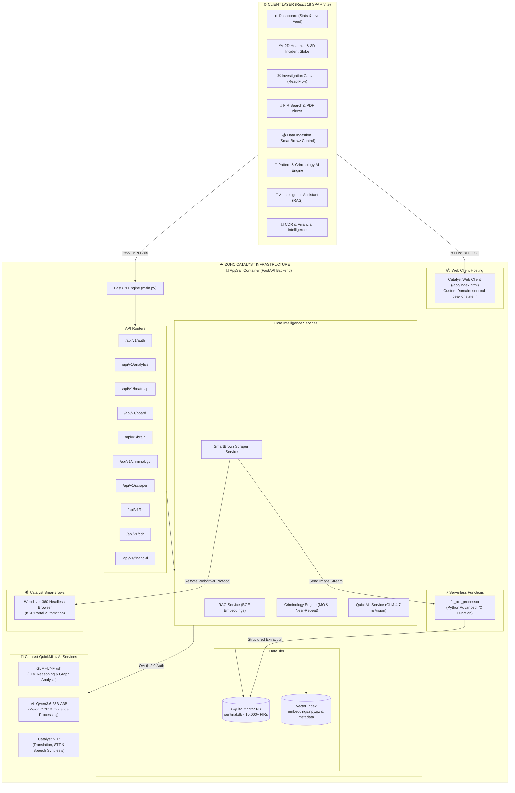
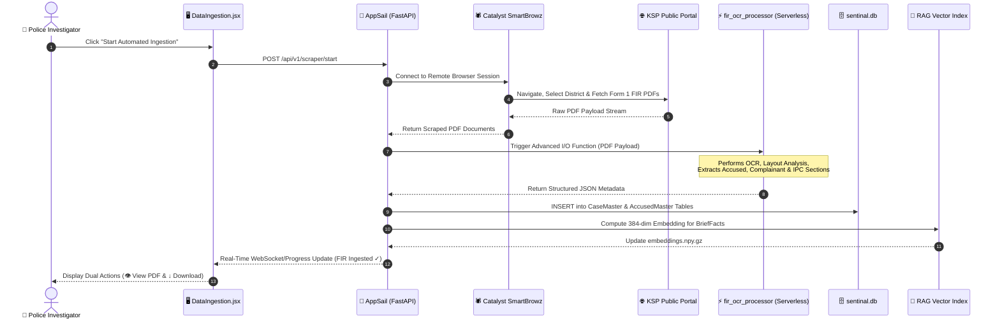
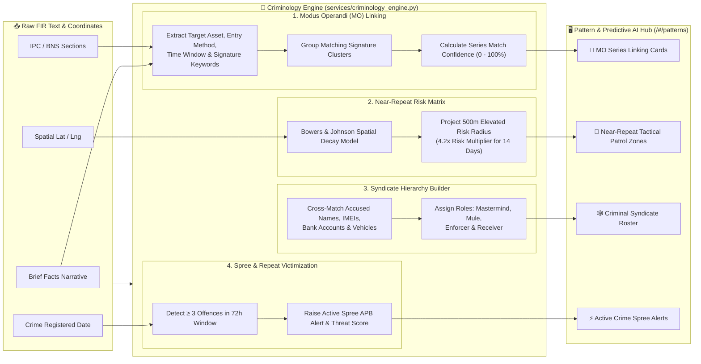
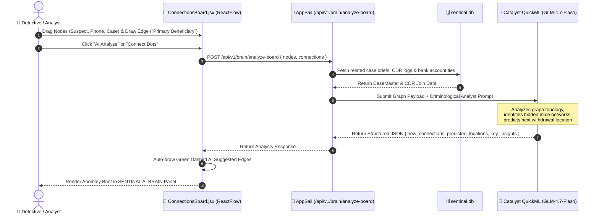

# 🛡️ Project Sentinal — Complete System Architecture, Logic & Workflow Guide

> **Karnataka Police Crime Intelligence & Predictive AI Platform**  
> Powered by **Zoho Catalyst (AppSail, Serverless Functions, QuickML, DataStore, SmartBrowz)**

---

## 📐 1. Master System Architecture & Component Connections

---

## 🔄 2. Data Ingestion & Automated OCR Pipeline Logic

---

## 🧬 3. Criminology Pattern & Predictive AI Logic

---

## 🕸️ 4. Investigation Canvas & AI Graph Analysis Workflow

---

## 📋 5. Comprehensive Feature & Component Matrix

| Feature Module | Primary Component / Page | API Endpoint | Description & Underpinning Logic |
|---|---|---|---|
| **Command Center Dashboard** | [`Dashboard.jsx`](file:///c:/Users/techp/Downloads/more%20projects/Sentinal%20new/frontend/src/pages/Dashboard.jsx) | `GET /api/v1/analytics/overview` | High-level KPI metrics (Total FIRs, Arrests, Charge Sheet Rate, Cyber Crimes), district performance rankings, and live crime feed. |
| **2D Heatmap & 3D Incident Globe** | [`GeospatialMap.jsx`](file:///c:/Users/techp/Downloads/more%20projects/Sentinal%20new/frontend/src/pages/GeospatialMap.jsx) | `GET /api/v1/heatmap/points` `GET /api/v1/heatmap/dbscan-clusters` | Renders Leaflet 2D density maps & Three.js 3D solid oceanic globe with cyan grid, atmosphere glow halo, and vertical 3D incident light beams pointing at crime locations. |
| **Investigation Canvas** | [`ConnectionsBoard.jsx`](file:///c:/Users/techp/Downloads/more%20projects/Sentinal%20new/frontend/src/pages/ConnectionsBoard.jsx) | `POST /api/v1/board/canvas/save` `POST /api/v1/brain/analyze-board` | Infinite ReactFlow corkboard for linking suspects, cases, vehicles, phones & financial accounts. Features QuickML AI graph analysis and auto-connection suggestions. |
| **Pattern & Predictive AI Hub** | [`PatternIntel.jsx`](file:///c:/Users/techp/Downloads/more%20projects/Sentinal%20new/frontend/src/pages/PatternIntel.jsx) | `GET /api/v1/criminology/mo-clusters` `GET /api/v1/criminology/near-repeat-risk` `GET /api/v1/criminology/syndicate-graph` | Executes Modus Operandi (MO) series linking, Bowers & Johnson Near-Repeat spatial risk multipliers, syndicate role extraction, and spree alerts. |
| **FIR Search & PDF Viewer** | [`FIRSearch.jsx`](file:///c:/Users/techp/Downloads/more%20projects/Sentinal%20new/frontend/src/pages/FIRSearch.jsx) | `GET /api/v1/fir/list` `GET /api/v1/fir/fetch` | Live lookup across 10,000+ Karnataka FIRs. Renders official KSP Form 1 HTML document preview in an iframe with 1-click binary Blob PDF downloads. |
| **Data Ingestion Control** | [`DataIngestion.jsx`](file:///c:/Users/techp/Downloads/more%20projects/Sentinal%20new/frontend/src/pages/DataIngestion.jsx) | `POST /api/v1/scraper/start` `GET /api/v1/scraper/status` | Controls Catalyst SmartBrowz multi-worker headless scrapers. Features dual **👁 View PDF** and **↓ Download** action buttons. |
| **AI Copilot (RAG Assistant)** | [`AIAssistant.jsx`](file:///c:/Users/techp/Downloads/more%20projects/Sentinal%20new/frontend/src/pages/AIAssistant.jsx) | `POST /api/v1/intelligence/query` | Conversational RAG agent performing 384-dim vector similarity searches across 10,000+ FIR records via Catalyst QuickML (GLM-4.7-Flash). |
| **Financial & Mule Intelligence** | [`FinancialIntel.jsx`](file:///c:/Users/techp/Downloads/more%20projects/Sentinal%20new/frontend/src/pages/FinancialIntel.jsx) | `GET /api/v1/financial/transactions` | Detects suspicious money transfers, shell account rings, and high-velocity mule account cashouts. |
| **CDR Analysis Engine** | [`CDRAnalytics.jsx`](file:///c:/Users/techp/Downloads/more%20projects/Sentinal%20new/frontend/src/pages/CDRAnalytics.jsx) | `POST /api/v1/cdr/upload` | Parses Call Detail Records (CDR) to identify top callers, tower co-location overlaps, and night-time communication bursts. |
| **3D Criminal Network Graph** | [`NetworkGraph3D.jsx`](file:///c:/Users/techp/Downloads/more%20projects/Sentinal%20new/frontend/src/pages/NetworkGraph3D.jsx) | `GET /api/v1/network/nodes` | 3D force-directed WebGL graph visualization showing criminal organizational trees, hubs, and isolated bridges. |
| **Serverless OCR Processor** | `functions/fir_ocr_processor` | Advanced I/O Function URL | Catalyst Serverless function executing layout OCR on raw FIR PDF bytes to extract structured fields into Catalyst DataStore. |

---

### 🌐 Live Deployment Endpoints
- **Primary Application (Catalyst Serverless)**: [https://sentinal-60073535541.development.catalystserverless.in/app/index.html](https://sentinal-60073535541.development.catalystserverless.in/app/index.html)
- **Slate Custom Domain**: [https://sentinal-peak.onslate.in](https://sentinal-peak.onslate.in)
- **AppSail Backend API**: [https://sentinal-backend-50043676705.development.catalystappsail.in](https://sentinal-backend-50043676705.development.catalystappsail.in)
