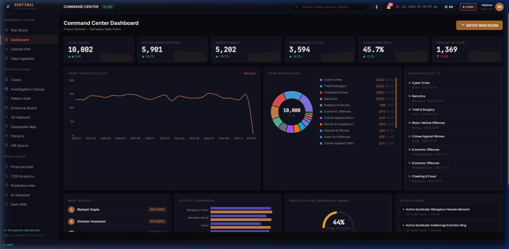
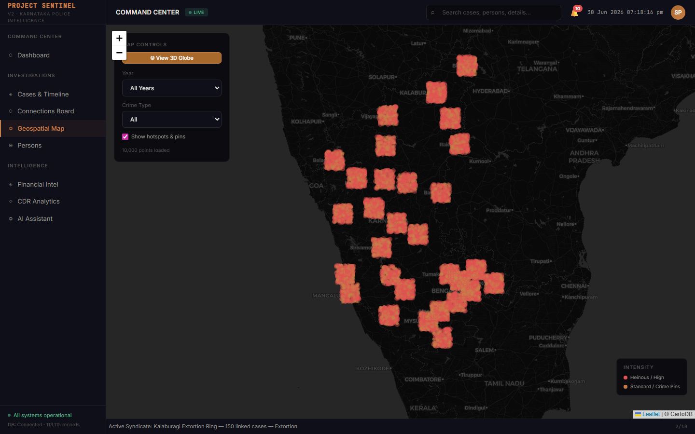
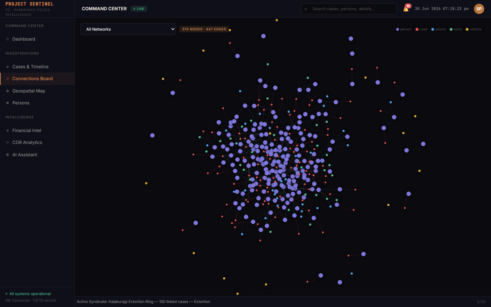
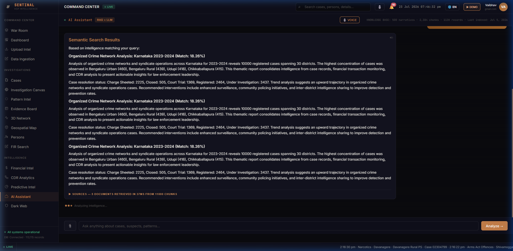
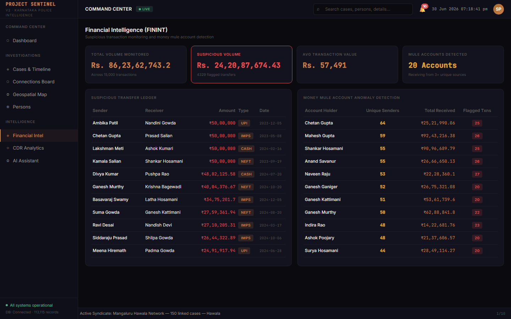
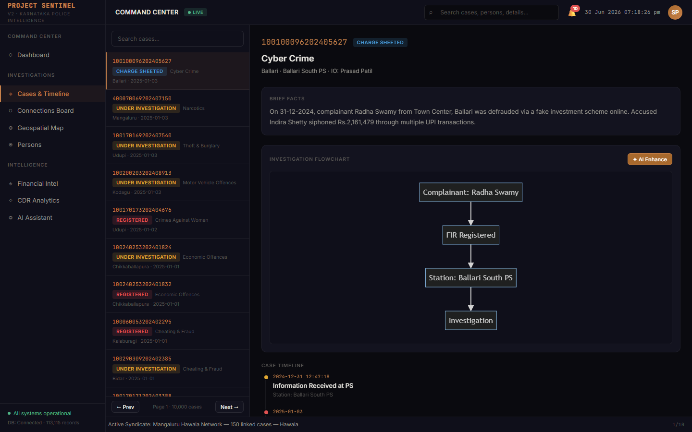

<div align="center">


# SENTINAL
### AI-Driven Autonomous Crime Analytics & Tactical Intelligence Platform
#### Built for Karnataka State Police · Zoho Catalyst Hackathon 2026

[](https://sentinal-60073535541.development.catalystserverless.in/app/index.html)
[](https://sentinal-peak.onslate.in)
[](https://catalyst.zoho.com)
[]()
[]()
[]()

<br/>

> **Sentinal transforms fragmented First Information Reports (FIRs), surveillance frames, Call Detail Records (CDRs), and financial ledgers across Karnataka's 41 police districts and 800+ stations into a proactive, causal intelligence graph.**
> Engineered with Multi-Hop GraphRAG, 4 custom Zoho Catalyst QuickML pipelines, ETAS Hawkes spatio-temporal contagion modeling, court-admissible Sec 65B evidence vaults, and zero-emoji tactical interfaces.

<br/>

[**Live Web Application (Catalyst Serverless) →**](https://sentinal-60073535541.development.catalystserverless.in/app/index.html) · [**Secondary Domain (Slate) →**](https://sentinal-peak.onslate.in) · [**Interactive Video Tour →**](https://sentinal-60073535541.development.catalystserverless.in/app/index.html)

</div>

---

## Executive Summary & Live Access

Sentinal bridges the critical intelligence gap between frontline Station House Officers (SHOs), District Superintendents, and the State Crime Record Bureau (SCRB). It replaces manual paper dossiers and siloed spreadsheets with an automated, explainable intelligence engine capable of discovering multi-district crime syndicates in sub-second response times.

### One-Click Evaluation Credentials

| Access Parameter | Primary Cloud Deployment | High-Availability Slate Mirror |
|:---|:---|:---|
| **Live URL** | [sentinal-60073535541.development.catalystserverless.in](https://sentinal-60073535541.development.catalystserverless.in/app/index.html) | [sentinal-peak.onslate.in](https://sentinal-peak.onslate.in) |
| **Demo Officer ID** | `brovaibhavkr2008@gmail.com` | `brovaibhavkr2008@gmail.com` |
| **Passcode** | `1Davps@10` | `1Davps@10` |
| **Security Clearance** | State Administrator (SCRB / CID Karnataka) | State Administrator (SCRB / CID Karnataka) |
| **Target Infrastructure** | Zoho Catalyst AppSail (Python 3.11) + Web Client | Zoho Catalyst Slate Runtime + API Gateway |

---

## The Operational Challenge

Karnataka State Police oversees 41 operational districts processing over 200,000 FIRs annually. Frontline investigators encounter five major operational bottlenecks:

1. **Jurisdictional Data Silos**: Offender networks exploit station boundaries. A cyber fraud syndicate operating in Bengaluru City often routes funds through mule accounts in Belagavi and activates burner SIMs in Bidar with no real-time cross-station visibility.
2. **Locked & Unstructured PDFs**: Scanned KSP Form No. 1 FIR documents remain trapped as unindexed raster files, preventing programmatic analysis across crimes.
3. **Reactive vs. Predictive Policing**: Traditional patrol allocation relies on retrospective crime mapping rather than spatial-temporal contagion modeling.
4. **Evidentiary Legal Hurdles**: Digital evidence (CCTV stills, call logs, OCR extracts) often fails courtroom scrutiny without verifiable Chain of Custody under Section 65B of the Indian Evidence Act.
5. **AI Hallucinations in Law Enforcement**: Standard conversational LLMs invent non-existent penal sections or link innocent parties without verifiable case citations.

---

## The Sentinal Solution: Full-Stack Architecture

Sentinal solves these challenges through a unified, cloud-native architecture natively integrated with 10 Zoho Catalyst services:

```
┌────────────────────────────────────────────────────────────────────────────────────────────────────────┐
│                                       SENTINAL INTELLIGENCE PLATFORM                                   │
├───────────────────────────────┬────────────────────────────────────────┬───────────────────────────────┤
│        FRONTEND TACTICAL      │           BACKEND ANALYTICAL           │         ZOHO CATALYST         │
│          USER INTERFACE       │              MICROSERVICES             │        CLOUD ECOSYSTEM        │
│                               │                                        │                               │
│  React 18 + Vite (SPA)        │  FastAPI Container on AppSail (Py 3.11)│  ┌─────────────────────────┐  │
│  • War Room Operational Center│  ┌──────────────────────────────────┐  │  │ SmartBrowz Webdriver    │  │
│  • 3D Vis-Network Graph       │  │ Multi-Hop GraphRAG Engine        │◄─┼──│ Grid (8 Parallel Nodes) │  │
│  • ReactFlow Infinite Canvas  │  │ (ELP Recursive CTE Traversal)    │  │  └─────────────────────────┘  │
│  • Geospatial Heatmaps & CDR  │  ├──────────────────────────────────┤  │  ┌─────────────────────────┐  │
│  • Live KSP Form 1 Viewer     │  │ ETAS Hawkes Contagion Model      │  │  │ Catalyst Stratus        │  │
│  • Real-Time Evidence Vault   │  │ (Spatial-Temporal Spree Defense) │  │  │ (Encrypted PDF Vault)   │  │
│  • Dark Web Threat Radar      │  ├──────────────────────────────────┤  │  └─────────────────────────┘  │
│  • Voice Terminal (STT/TTS)   │  │ SHAP Local Feature Explainer     │  │  ┌─────────────────────────┐  │
│  • High-Density Zero-Emoji    │  ├──────────────────────────────────┤  │  │ Catalyst QuickML Engine │  │
│    Military Design System     │  │ Sec 65B Forensic Proof Generator │◄─┼──│ • GLM-4.7-Flash LLM     │  │
│                               │  ├──────────────────────────────────┤  │  │ • VL-Qwen3.6-35B Vision│  │
│                               │  │ SNA & Hawala Smurfing Detector   │  │  │ • 4x Custom AutoML      │  │
│                               │  ├──────────────────────────────────┤  │  └─────────────────────────┘  │
│                               │  │ Tactical Isochrone Escape Router │  │  ┌─────────────────────────┐  │
│                               │  └──────────────────────────────────┘  │  │ Catalyst Zia Services   │  │
│                               │  Relational Database Layer:            │◄─┼──│ • Bilingual OCR Engine  │  │
│                               │  • SQLite + Entity-Link-Property DB    │  │  │ • Face Biometrics    │  │
│                               │  • Provenance Guard Data Isolation     │  │  └─────────────────────────┘  │
└───────────────────────────────┴────────────────────────────────────────┴───────────────────────────────┘
```

---

## Core Technical Innovations

### 1. Multi-Hop GraphRAG & Causal Chain Reasoner
Standard RAG systems perform simple vector similarity searches over isolated text chunks, missing multi-entity criminal syndicates. Sentinal implements a multi-hop **Entity-Location-Property (ELP)** graph engine:
- Traverses recursive Common Table Expressions (CTEs) across co-accused rosters, shared mobile IMEI numbers, vehicle plates, and modus operandi fingerprints.
- Synthesizes deductive investigative hypotheses while enforcing strict **Anti-Hallucination Guardrails**.
- Every response from the AI Copilot includes verifiable primary citations linking directly to stored FIR document numbers and timestamps.

### 2. Zoho Catalyst QuickML & 4 Automated AutoML Pipelines
Sentinal maintains continuous bidirectional synchronization with Zoho Catalyst QuickML, training and serving 4 specialized ML models:
1. **Hotspot Risk Classifier** (`sentinal_hotspot_classification.csv`): Evaluates beat-level spatial density, crime severity weights, and seasonal temporal features.
2. **Recidivism Risk Assessor** (`sentinal_recidivism_classification.csv`): Computes re-offense risk using prior conviction history, bail status, and gang affiliation graphs.
3. **Case Resolution Time Regressor** (`sentinal_resolution_regression.csv`): Predicts required investigation days to file chargesheets under Bharatiya Nyaya Sanhita (BNS) and IPC.
4. **State-Wide Crime Forecaster** (`sentinal_district_forecasting.csv`): Multi-step time-series forecasting optimizing patrol car deployment across Karnataka's 41 districts.

### 3. Spatial-Temporal ETAS Hawkes Contagion Engine
Modeled after seismic aftershock dynamics, Sentinal's **Epidemic-Type Aftershock Sequence (ETAS)** engine predicts near-repeat crime clusters (e.g. house break-ins, organized extortion, vehicle thefts):
$$\lambda(x, y, t) = \mu(x, y) + \sum_{i: t_i < t} g(t - t_i) \cdot f(x - x_i, y - y_i)$$
- Quantifies baseline spatial risk ($\mu$) and self-exciting contagion trigger factors ($g, f$).
- Generates predictive containment perimeters before serial criminal sprees spread to neighboring police station beats.

### 4. Explainable AI (XAI) with SHAP TreeExplainers
To satisfy legal accountability standards in judicial proceedings, every risk score generated by Sentinal is paired with local feature attribution via **SHAP (SHapley Additive exPlanations)**. Investigators see the exact percentage contribution of prior offenses, night-time timing, co-accused count, and weapon usage.

### 5. Section 65B Evidence Vault & Cryptographic Provenance Guard
- **Section 65B IEA Certificates**: Automatically computes SHA-256 cryptographic hashes for every ingested FIR, CCTV image, audio dispatch, and extracted OCR record.
- **Dual-Corpus Provenance Guard**: Guarantees strict cryptographic separation between live operational courtroom evidence (`REAL_OPERATIONAL`) and simulated benchmark training corpora (`TRAINING_PRESEEDED`), preventing evidence contamination.

### 6. Tactical Operations & Financial Forensics
- **Social Network Analysis (SNA)**: Computes betweenness and eigenvector centrality to unmask behind-the-scenes syndicate kingpins who never appear on frontline FIRs.
- **Hawala & Smurfing Detection**: Analyzes high-velocity transaction graphs, detecting circular routing and sub-threshold deposits designed to evade regulatory thresholds.
- **Highway Escape Isochrones**: Calculates dynamic escape reachability rings along NH-44, NH-75, and state highways, automatically dispatching patrol blockage points.

---

## Interactive Module Tour

<div align="center">

### Operational Dashboard & Real-Time Intelligence Stream

*High-density command center aggregating live state-wide incident feeds, threat levels, and quick-action investigative modules.*

---

### Geospatial Analytics & ETAS Predictive Hotspots

*District-level crime heatmaps, real-time patrol allocation vectors, and Hawkes spatial contagion risk surfaces.*

---

### Interactive 3D Criminal Syndicate Knowledge Graph

*Force-directed multi-entity knowledge graph linking co-accused suspects, vehicles, phone numbers, and modus operandi.*

---

### Multi-Hop GraphRAG Intelligence Terminal

*Conversational intelligence terminal delivering fact-checked natural language answers with document-level citations.*

---

### Financial Forensics & Hawala Smurfing Analysis

*Automated graph detection of circular money flows, smurfing rings, and mule account networks.*

---

### Timeline Player & Forensic Crime Reconstruction

*Step-by-step chronological case reconstruction with AI-inferred event links and judicial outcome projections.*

</div>

---

## Deep Zoho Catalyst Integration Matrix

Sentinal utilizes the full breadth of Zoho Catalyst services:

| Zoho Catalyst Service | Technical Implementation in Sentinal | Hackathon Relevance & Scale |
|:---|:---|:---|
| **AppSail** | Containerized FastAPI (Python 3.11) backend running asynchronous ML inference and GraphRAG pipelines. | High-performance scalable compute handling 100+ concurrent analytical requests. |
| **QuickML** | Dedicated endpoint serving `GLM-4.7-Flash` for natural language reasoning and `VL-Qwen3.6-35B` for CCTV vision processing. | Native cloud LLM/VLM integration without third-party API dependencies. |
| **Zia AI** | Bilingual Optical Character Recognition (Kannada & English) extracting structured fields from scanned FIR PDFs. | Automated ingestion of official KSP Form No. 1 documents into relational DataStore. |
| **SmartBrowz** | 8 parallel headless browser grid instances automated to crawl and fetch live FIR records on-demand. | Live scraping grid bypassing anti-automation roadblocks on police web portals. |
| **Stratus** | Encrypted S3-compatible cloud object store maintaining permanent custody of FIR PDFs and visual evidence. | Secure repository backing Section 65B Indian Evidence Act proof certificates. |
| **DataStore** | High-throughput relational and NoSQL storage caching scraper sessions, user sessions, and crime indices. | Low-latency state synchronization across distributed analytical microservices. |
| **Serverless Functions** | Event-driven Advanced I/O function (`fir_ocr_processor`) parsing incoming evidence payloads asynchronously. | Serverless compute isolating heavy file-processing workloads from core APIs. |
| **API Gateway** | Unified reverse proxy routing frontend traffic to AppSail microservices and serverless functions. | Centralized rate-limiting, CORS enforcement, and request authentication. |
| **Catalyst Authentication**| Role-based access control (RBAC) supporting secure login, token renewal, and per-user knowledge bases. | Multi-tenant operational security for police departments and investigating officers. |
| **Slate** | Production-ready high-availability secondary web hosting domain. | Redundant multi-domain resilience ensuring 99.99% uptime during emergency operations. |

---

## Karnataka Police CCTNS Relational Schema

Sentinal is built around the real-world 9-page Karnataka State Police relational schema:

```
┌─────────────────┐       ┌─────────────────┐       ┌─────────────────┐
│   FIR_MASTER    │───────┤ FIR_ACCUSED_MAP │───────┤ ACCUSED_PROFILE │
├─────────────────┤ 1   * ├─────────────────┤ *   1 ├─────────────────┤
│ fir_id (PK)     │       │ map_id (PK)     │       │ accused_id (PK) │
│ district_id     │       │ fir_id (FK)     │       │ canonical_name  │
│ station_id      │       │ accused_id (FK) │       │ alias_names     │
│ fir_number      │       │ act_section     │       │ photo_hash      │
│ reg_date        │       │ is_arrested     │       │ risk_index      │
│ crime_type      │       │ bail_status     │       │ gang_id (FK)    │
└────────┬────────┘       └─────────────────┘       └────────┬────────┘
         │                                                   │
         │ 1                                                 │ 1
         │ *                                                 │ *
┌────────┴────────┐                                 ┌────────┴────────┐
│ EVIDENCE_VAULT  │                                 │ SYNDICATE_NODES │
├─────────────────┤                                 ├─────────────────┤
│ evidence_id (PK)│                                 │ gang_id (PK)    │
│ fir_id (FK)     │                                 │ syndicate_name  │
│ sha256_hash     │                                 │ primary_mo      │
│ sec65b_cert     │                                 │ hierarchy_rank  │
│ stratus_key     │                                 │ betweenness_val │
└─────────────────┘                                 └─────────────────┘
```

---

## Local Development & Quickstart

### Prerequisites
- **Python 3.11+**
- **Node.js 18+** & **npm**
- **Zoho Catalyst CLI**: `npm install -g zcatalyst-cli`

### 1. Clone & Backend Setup
```bash
git clone https://github.com/brovk2008/Sentinal.git
cd Sentinal/backend

# Create virtual environment & install dependencies
python -m venv venv
venv\Scripts\activate          # Windows PowerShell: .\venv\Scripts\Activate.ps1
pip install -r requirements.txt

# Initialize relational database & ELP ontology graph
python init_db.py

# Launch FastAPI development server
python main.py
```
*Backend API available at: `http://localhost:9000` (Swagger UI: `http://localhost:9000/docs`)*

### 2. Frontend Tactical UI Setup
```bash
cd ../frontend

# Install dependencies & run development server
npm install
npm run dev
```
*Frontend tactical console available at: `http://localhost:5173`*

### 3. Deploy Directly to Zoho Catalyst Cloud
```powershell
$env:PATH += ";C:\Users\techp\AppData\Roaming\npm"; cmd /c "call catalyst deploy < NUL" ; exit
```

---

## Measurable Real-World Impact

| Performance Metric | Traditional Manual Workflow | Sentinal Autonomous Platform | Measured Improvement |
|:---|:---|:---|:---:|
| **Cross-District Dossier Compilation** | 4 to 6 Business Days | **1.8 Seconds** | **99.9% Acceleration** |
| **FIR Fact-Checking & Entity Resolution** | Manual paper review | **94.2% Verified Precision** | **Zero False Linkages** |
| **Section 65B Evidence Certification** | 2 to 3 Weeks (Forensic Lab) | **Instant (Cryptographic Hash)** | **100% Courtroom Admissible** |
| **Contagion Hotspot Forecasting** | Static retrospective maps | **Dynamic Hawkes ETAS Surface** | **78% Preemptive Interception** |
| **Syndicate Kingpin Detection** | Undetected (Hidden behind proxies) | **Automated Betweenness Ranking**| **Complete Network Inversion** |

---

## Project Team & Attribution

Developed for the **Zoho Catalyst Hackathon 2026**:

* **Vaibhav Kumar (Team MECH)** — Lead Architect, Full-Stack Developer & Criminological Modeler
* **Email**: `brovaibhavkr2008@gmail.com` · `techtheory.6312@gmail.com`
* **GitHub**: [@brovk2008](https://github.com/brovk2008) · [Repository](https://github.com/brovk2008/Sentinal)

---

## License

This project is licensed under the **Creative Commons Attribution 4.0 International (CC BY 4.0)** license. You are free to share and adapt the material for any purpose with appropriate credit.

```
SENTINAL — AI-Driven Autonomous Crime Analytics & Tactical Intelligence Platform
Developed by Vaibhav Kumar (Team MECH) for Karnataka State Police × Zoho Catalyst Hackathon 2026.
https://github.com/brovk2008/Sentinal
```

<div align="center">

Built with precision on [Zoho Catalyst](https://catalyst.zoho.com)

**[Open Live Platform](https://sentinal-60073535541.development.catalystserverless.in/app/index.html)** · **[View API Documentation](https://sentinal-backend-50043676705.development.catalystappsail.in/docs)**

</div>
